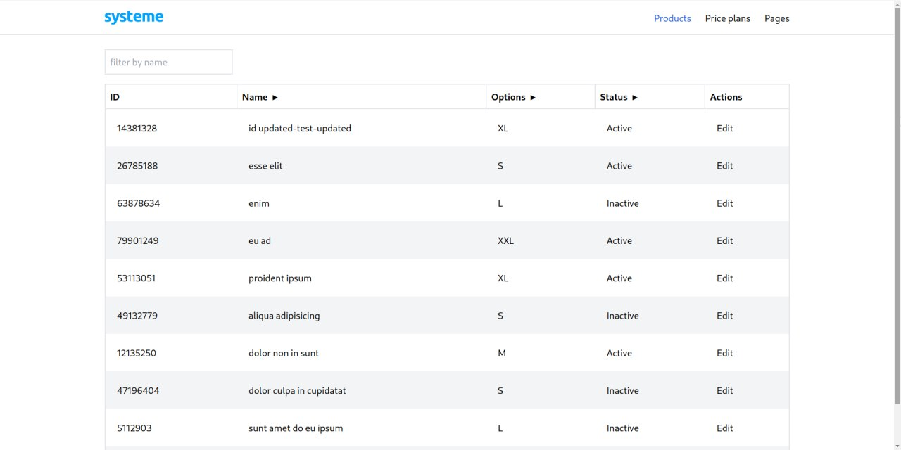
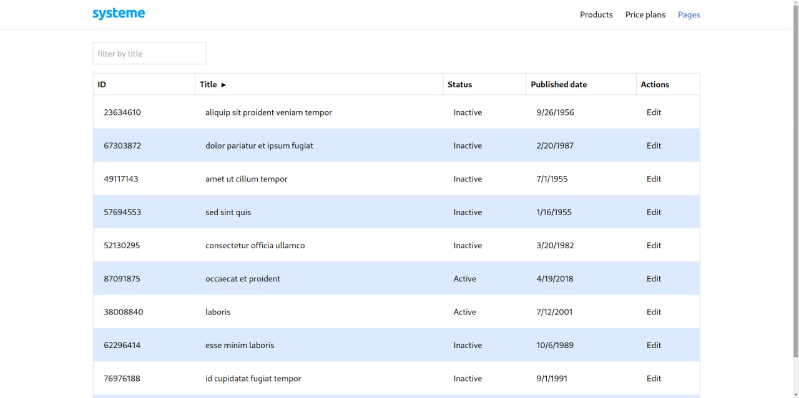
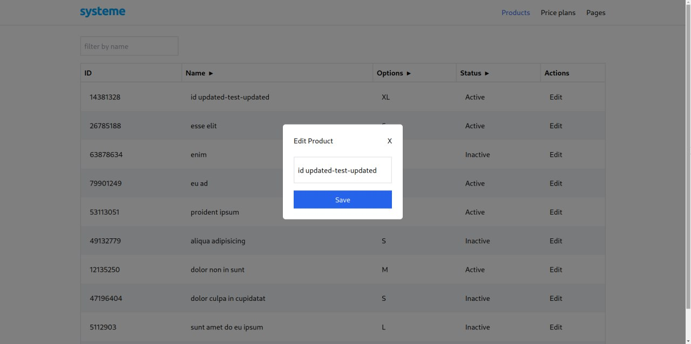

# Тестовое задание для Systeme.io
Есть несколько видов данных. (в качестве данных для задания - 3 вида, но представим, что там может быть сотня видов данных). Нужно отобразить их и фильтровать по текстовым полям.

- Каждый тип данных (Products, Price Plans, Pages) должен быть на отдельной странице. На каждой из этих страниц должен переиспользоваться компонент таблицы. ✅

- Мы хотим увидеть реализацию таблицы, поэтому готовые решения использовать нельзя. ✅
- Таблица отрисовывает в качестве заголовка ключ объекта или любой JSX элемент ✅
- Таблица отрисовывает в качестве ячейки JSX элемент, содержащий в каком-либо виде значение объекта. ✅
- Нажимая на кнопку Edit, мы сможем обновлять данные в модалке, которые при сохранении обновляют данные в таблице. Для простоты обновляем только текстовые поля. ✅
- Код должен быть унифицированным и масштабируемым.( нужно использовать возможности Typesript`а ) ✅

## 🎥 Демо
### [https://https://systeme-io-test-chupapee.vercel.app](https://systeme-io-test-chupapee.vercel.app/)

## 📸 Скриншоты




## 🛠️ Инструкция по запуску проекта:
Склонируйте репозиторий, установите зависимости и запустите проект:
```shell
git clone https://github.com/chupapee/alif-test-task.git <название папки>
yarn
yarn dev
```
